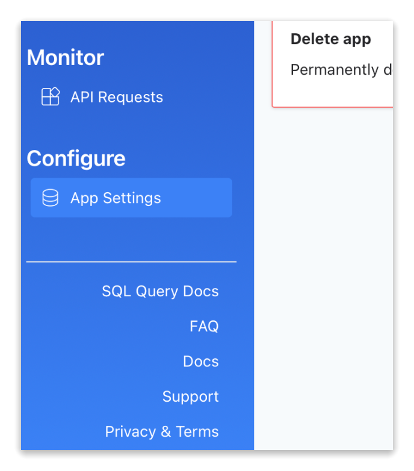
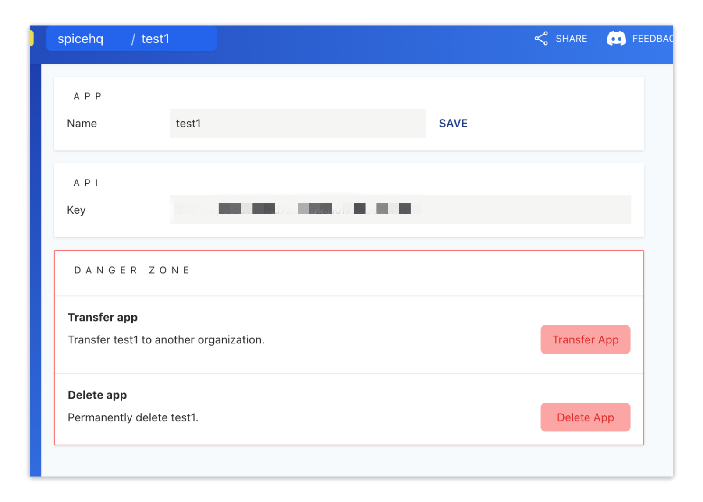
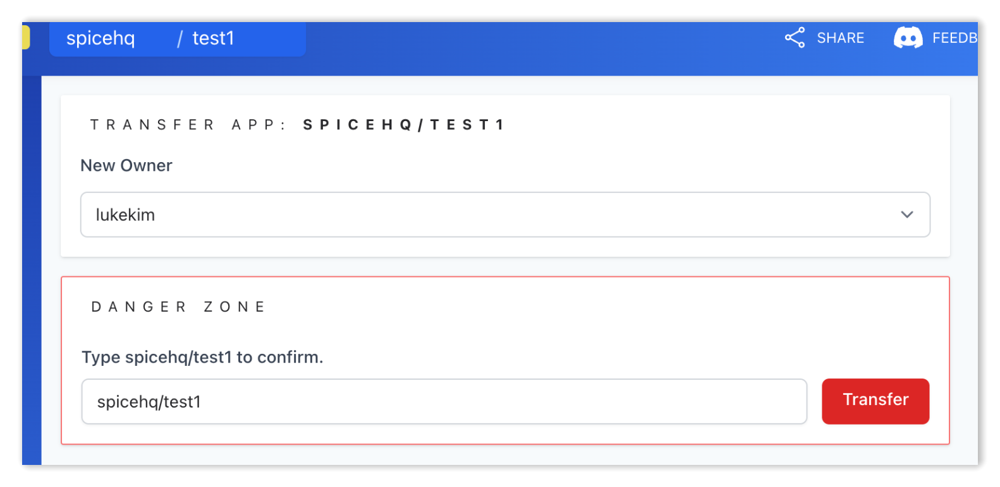

# Transfer an App

You can easily transfer an App's ownership to another [**organization**](../../getting-started/core-concepts/organizations.md)**.**


App transfer is currently limited to organizations you have access to.

Spice Design Partners can request back-office transfer. To get in touch regarding the Design Partner program send mail to [hey@spice.ai](mailto:hey@spice.ai).


Learn more about [**organization management**](../organizations.md).

## Transfer an App

1. To transfer an app, click **App Settings** in the **Configure** section of the portal sidebar.

<figure><figcaption>
App Settings in the portal sidebar.
</figcaption></figure>

2. In the **Danger Zone** section of **App Settings**, click the **Transfer App** button.

<figure><figcaption></figcaption></figure>

3. On the **Transfer App** page, select the **New Owner** organization from the menu.

<figure><figcaption></figcaption></figure>

4. Type the full app name into the text box to confirm and click **Transfer** to complete process.

The App will now be accessible by the receiving organization and it's members.

