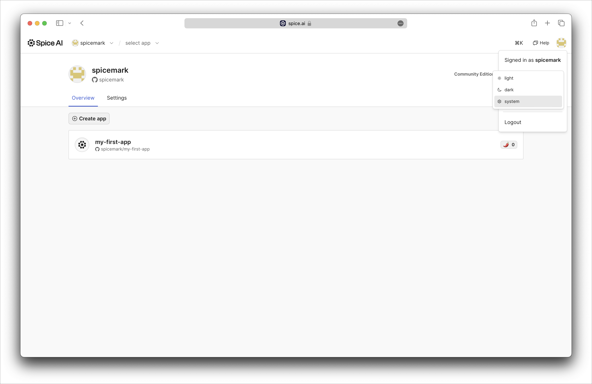

# Profile Settings

### Dark Mode

A light or dark mode portal theme can be set:

1. Click the profile picture on the top right corner of the portal interface.
2. From the dropdown menu, find and select the **Theme** option.
3. Select **Light**, **Dark**, or **System**.

<figure><figcaption>
Spice.ai light theme
</figcaption></figure>

<figure><figcaption>
Spice.ai dark theme
</figcaption></figure>

