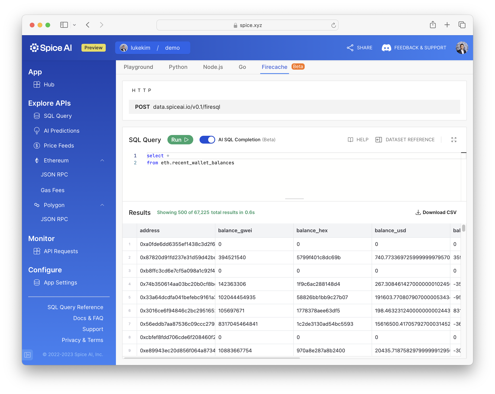

# Data Science & Machine Learning

Built with technologies like [Apache Arrow](../api/sql-query/apache-arrow-flight-api.md), Spice is designed from the ground-up for data-driven apps, data science and machine learning.

Get started with the following guide.

### 1. Find the data you need

Spice includes a growing set of web3 data, including blockchain data, cryptocurrency and token prices, ENS domains, and more.

<figure><figcaption>
The dataset reference in the SQL Playground.
</figcaption></figure>

Explore the full list of [**datasets**](../building-blocks/datasets.md) for an overview and see [**SQL Query Tables**](sql-query-tables/) for schemas and details.

### 2. Query datasets using SQL

Querying datasets is as easy as querying data from any SQL database. Try SQL from your browser at [**Spice.ai**](https://spice.ai/).

<figure><figcaption>
Querying datasets with SQL in the Playground.
</figcaption></figure>

Reference [**SQL best practices**](https://docs.spice.ai/best-practices) for tips and the best query performance.

### 3. Refer to the SQL reference

Spice uses an [**Apache Calcite**](https://calcite.apache.org) based query engine, which supports **ANSI SQL** with additional SQL **dialect**.

<figure><figcaption>
The SQL Reference at docs.spice.ai
</figcaption></figure>

Refer to the [**SQL reference**](sql-reference/) for dialect specific data types, functions, and commands. SQL keywords are also indexed in search for quick lookup.

### 4. Use the Python SDK

Import Spice data in notebooks like Kaggle, Jupyter Notebooks, Google Colab, Anaconda Notebook, etc. with [**3 lines of Python code**](https://docs.spice.ai/sdks/python-sdk#usage).

<figure><figcaption>
Querying Spice from Python in 3 lines of code.
</figcaption></figure>

### 5. Use familiar data science tools and libraries

Easily use Python libraries like **numpy, pandas, pyplot, sklearn, xgboost, and more** to perform **exploratory data analysis (EDA),** create articulate **visualizations**, and build dynamic **machine learning models.**

See sample Kaggle Notebooks on the next page --> \\
