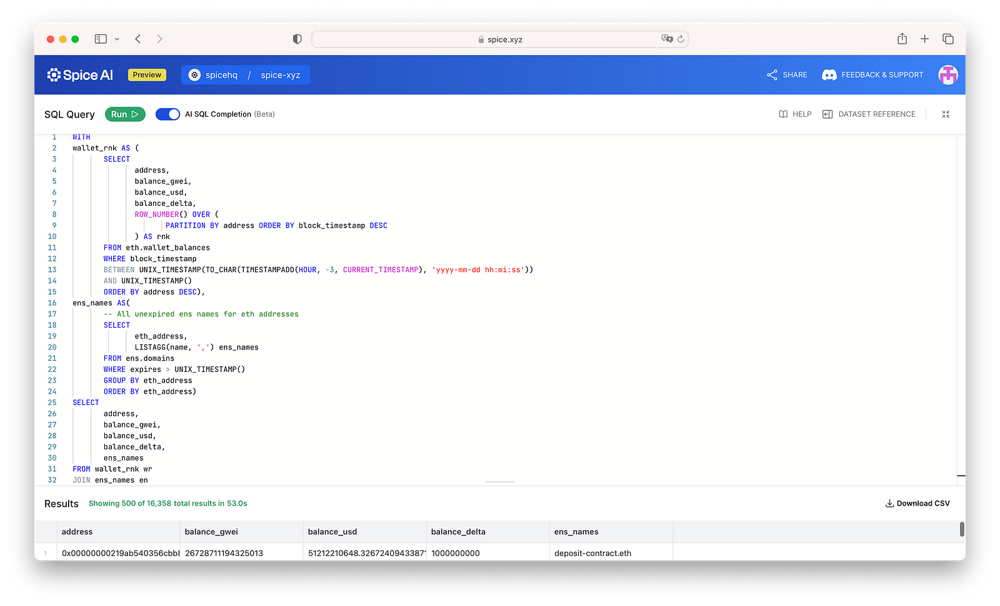
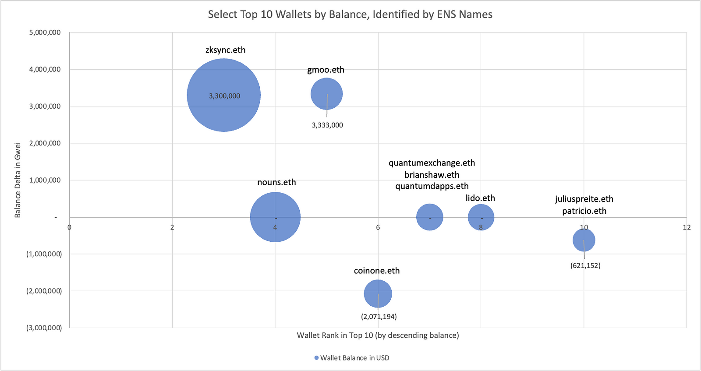

# Wallet Balances

Perform complex queries joining wallet balances with other datasets such as ENS names to derive usable insights for your apps and research. Querying the Wallet Balances datasets enable use cases like monitoring aggregate changes in wallet balances to track rewards sent to users, analyzing transaction trends for specific wallets week over week, and identifying the active "whale" wallets with their ENS names during major market events. Copy example queries directly into your Spice.ai Playground to get started in seconds.&#x20;

### Wallets with top balances, identified with their ENS names and balance change in gwei&#x20;

Identifying “whale” wallets that are reacting to x event with their ENS names by querying the up-to-date wallet balances, balance delta in the past 3 hours, in descending wallet balance.

**Typical query time**: <60 seconds.

```sql
--- wallet balances with ENS names and balance change:
WITH 
wallet_rnk AS (
       SELECT
              address,
              balance_gwei,
              balance_usd,
              balance_delta,
              ROW_NUMBER() OVER (
                     PARTITION BY address ORDER BY block_timestamp DESC
              ) AS rnk
       FROM eth.wallet_balances
       WHERE block_timestamp
       BETWEEN UNIX_TIMESTAMP(TO_CHAR(TIMESTAMPADD(HOUR, -3, CURRENT_TIMESTAMP), 'yyyy-mm-dd hh:mi:ss'))
       AND UNIX_TIMESTAMP()
       ORDER BY address DESC),
ens_names AS(
       -- All unexpired ens names for eth addresses
       SELECT
              eth_address,
              LISTAGG(name, ',') ens_names
       FROM ens.domains
       WHERE expires > UNIX_TIMESTAMP()
       GROUP BY eth_address
       ORDER BY eth_address)
SELECT 
       address,
       balance_gwei,
       balance_usd,
       balance_delta,
       ens_names
FROM wallet_rnk wr
JOIN ens_names en
ON wr.address = en.eth_address
WHERE wr.rnk = 1
ORDER BY balance_gwei DESC
```

<figure><figcaption><p>Query: Wallets with top balances, identified with their ENS names and balance change in gwei.</p></figcaption></figure>

<figure><figcaption><p>Select wallets with the top 10 balances, identified with their ENS names.</p></figcaption></figure>

## Analyze transaction trends for a specific group of highly active wallets week over week

Find historical absolute-value snapshot balances via `eth.wallet_balances`.

**Typical query time**: <1 second.

```sql
-- get the net peak-to-peak balance change for a wallet over the last week
SELECT address, max(balance_gwei) - min(balance_gwei) as "last week delta (gwei)", max(balance_usd) - min(balance_usd) as "last week delta (USD)"
FROM eth.wallet_balances
WHERE address = '0x28c6c06298d514db089934071355e5743bf21d60'
AND block_timestamp > UNIX_TIMESTAMP() - 7*24*60*60*1000
GROUP BY address
```

